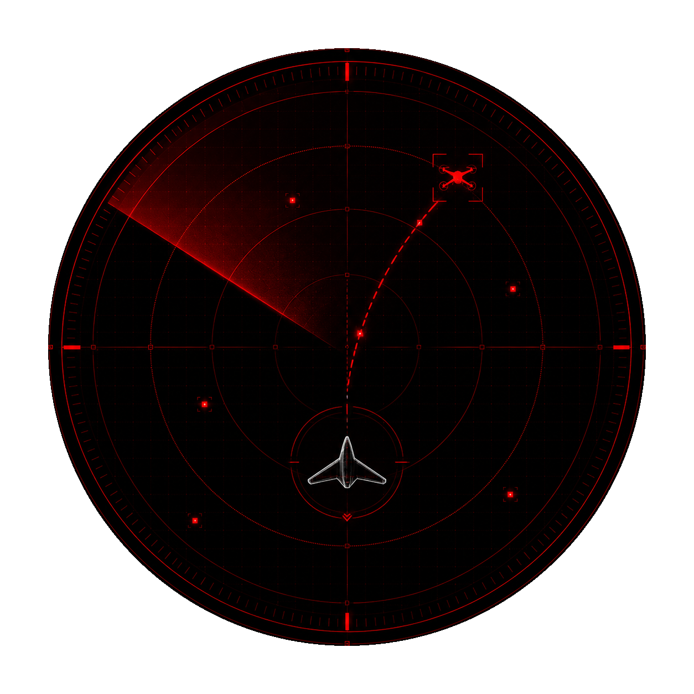

<div align="center">
  <table>
    <tr>
      <td>
<pre style="color: #cc0000; margin: 0;">
 █████╗    ██████╗    ███████╗
██╔══██╗   ██╔══██╗   ██╔════╝
███████║   ██║  ██║   ███████╗
██╔══██║   ██║  ██║   ╚════██║
██║  ██║██╗██████╔╝██╗███████║██╗
╚═╝  ╚═╝╚═╝╚═════╝ ╚═╝╚══════╝╚═╝
</pre>
      </td>
      <td></td>
    </tr>
  </table>
</div>

<div align="center">

# AIR DEFENSE SYSTEM

**Optimal-pursuit interception simulator for unmanned aerial vehicles**


*Real-time simulation of guaranteed-capture pursuit strategies, built on*
*closed-form analytical models of optimal interception under uncertainty.*

</div>

---

## ▏OVERVIEW

**A.D.S.** simulates how a swarm of interceptors hunts down a swarm of evading drones
when the targets' parameters are only partially known. Each interceptor must
**guarantee** capture despite uncertainty about a target's speed, heading, or
starting position — and the system assigns interceptors to targets so that the
**slowest interception in the whole operation is as fast as possible** (bottleneck 
assignment problem).

---

## ▏INTERCEPTION MODELS

Three strategies, each defeating a different class of uncertainty.

<table>
<tr>
<td width="33%" valign="top">

### ◢ SPIRAL
**Unknown heading**

Speed known to a finite set, direction unknown. The interceptor runs a straight
leg, then a **logarithmic spiral** matching the target's radial distance —
sweeping every possible heading. Capture guaranteed within one revolution.

</td>
<td width="33%" valign="top">

### ◢ CIRCULAR
**Unknown everything**

Only a *circle* of possible starts, plus finite speed and heading sets. Reduces to
a differential equation solved through **incomplete elliptic integrals of the
second kind**. The hardest case.

</td>
<td width="33%" valign="top">

### ◢ TARGETING
**Pure pursuit**

The velocity vector points permanently at a target crossing at constant altitude.
The classic pursuit curve — closed-form trajectory and time-to-capture.

</td>
</tr>
</table>

---

## ▏MULTI-TARGET ASSIGNMENT

> **n** interceptors, **n** targets. Which hunts which?

A.D.S. solves the **bottleneck assignment problem** — minimize the maximum
interception time across all pairs. It binary-searches a threshold, builds 
a bipartite graph of pairs reachable within the threshold, and tests for a 
**perfect matching** via **Hopcroft–Karp**.

---

## ▏INSTALL

> **Requires Python 3.11+**

1.  **Clone the repository**
    ```bash
    git clone https://github.com/ShilovVyacheslav/AirDefenseSystem.git
    cd AirDefenseSystem
    ```
    
2.  **Create and activate virtual environment**

    **Windows:**
    ```bash
    python -m venv venv
    venv\Scripts\activate
    ```
    **Linux / macOS:**
    ```bash
    python3 -m venv venv
    source venv/bin/activate
    ``` 
    
3.  **Install dependencies**
    ```bash
    pip install -r requirements.txt
    ``` 
    
4.  **Install the package**
    ```bash
    pip install -e .
    ``` 
    
5.  **Run**
    ```bash
    ads --help
    ``` 

---

## ▏DEPLOY

```bash
# Default spiral pursuit from scenarios/spiral.yaml
ads --mode=multiple_spiral

# Swarm engagement: 100 spiral interceptors vs 100 targets, random setup
ads -m multiple_spiral -r -c 100

# Hardest model — circular scan with the threat matrix overlay, no intro
ads -m multiple_circular -r -c 50 --no-preview

# Scenario format reference
ads --scenario-info

# Circular scan from a hand-authored scenario file
ads -s scenarios/circular.yaml

# Continuous operation — auto-respawn waves after every wipe
ads -m multiple_targeting -r -c 30 --respawn
```

<details>
<summary><b>All flags</b></summary>

<br>

| Flag | Description                                             |
|------|---------------------------------------------------------|
| `-m, --mode MODE` | `single_`/`multiple_` × `spiral`/`circular`/`targeting` |
| `-r, --random` | Procedural random setup                                 |
| `-c, --count N` | Entity count for `multiple` modes                       |
| `-s, --scenario PATH` | Load setup from a `.yaml`/`.json` file                  |
| `--respawn` | Auto-respawn entities after all interceptions             |
| `--no-matrix` | Disable the pursuit-matrix overlay                      |
| `--no-preview` | Skip the boot/loading intro                                  |
| `--scenario-info` | Print scenario format reference and exit                |
| `-h, --help` | Usage and exit                                          |

`--mode` / `--count` / `--random` cannot be combined with `--scenario`.

</details>

---

## ▏ARCHITECTURE

```
src/
  cli.py          ▏ command-line interface, argument validation
  compute/        ▏ pursuit mathematics
    interception/ ▏ spiral, circular, targeting solvers
    ellipe/       ▏ elliptic-integral LUT + numba kernels
  domain/         ▏ entities, motion, assignment, setups
  loaders/        ▏ scenario parsing + schema validation
  ui/             ▏ tactical HUD, grid, overlays, boot
  core/           ▏ simulation loop, camera, input, render
  config/         ▏ settings, theme, fonts
scenarios/        ▏ default + example setups
```

---

## ▏FOUNDATION

Implements the models from the undergraduate thesis *"On the methods of optimal
pursuit of unmanned aerial vehicles"* (Applied Mathematics & Computer Science),
which derives the analytical trajectories, interception times, and the bottleneck
assignment algorithm. This project makes that mathematics interactive.

## ▏LICENSE

All rights reserved. This code is proprietary and confidential.

You may view this repository for reference only.
No copying, distribution, or modification is permitted without explicit written permission.